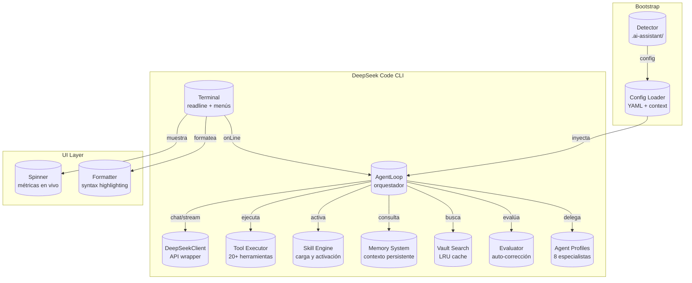

```mermaid
flowchart TB
    subgraph "DeepSeek Code CLI"
        TERM[("Terminal<br/>readline + menús")]
        AGENT[("AgentLoop<br/>orquestador")]
        CLIENT[("DeepSeekClient<br/>API wrapper")]
        TOOLS[("Tool Executor<br/>20+ herramientas")]
        SKILLS[("Skill Engine<br/>carga y activación")]
        MEMORY[("Memory System<br/>contexto persistente")]
        VAULT_S[("Vault Search<br/>LRU cache")]
        EVAL[("Evaluator<br/>auto-corrección")]
        PROFILES[("Agent Profiles<br/>8 especialistas")]
    end

    subgraph "UI Layer"
        SPINNER[("Spinner<br/>métricas en vivo")]
        FORMATTER[("Formatter<br/>syntax highlighting")]
    end

    subgraph "Bootstrap"
        DETECTOR[("Detector<br/>.ai-assistant/")]
        LOADER[("Config Loader<br/>YAML + context")]
    end

    TERM -->|"onLine"| AGENT
    AGENT -->|"chat/stream"| CLIENT
    AGENT -->|"ejecuta"| TOOLS
    AGENT -->|"activa"| SKILLS
    AGENT -->|"consulta"| MEMORY
    AGENT -->|"busca"| VAULT_S
    AGENT -->|"evalúa"| EVAL
    AGENT -->|"delega"| PROFILES
    TERM -->|"muestra"| SPINNER
    TERM -->|"formatea"| FORMATTER
    DETECTOR -->|"config"| LOADER
    LOADER -->|"inyecta"| AGENT
```
