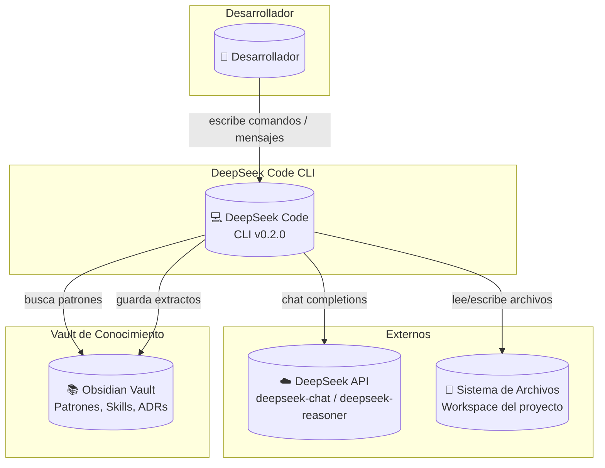

```mermaid
graph TB
    subgraph "Desarrollador"
        DEV[("👤 Desarrollador")]
    end

    subgraph "DeepSeek Code CLI"
        CLI[("💻 DeepSeek Code<br/>CLI v0.2.0")]
    end

    subgraph "Externos"
        DS[("☁️ DeepSeek API<br/>deepseek-chat / deepseek-reasoner")]
        FS[("📁 Sistema de Archivos<br/>Workspace del proyecto")]
    end

    subgraph "Vault de Conocimiento"
        VAULT[("📚 Obsidian Vault<br/>Patrones, Skills, ADRs")]
    end

    DEV -->|"escribe comandos / mensajes"| CLI
    CLI -->|"chat completions"| DS
    CLI -->|"lee/escribe archivos"| FS
    CLI -->|"busca patrones"| VAULT
    CLI -->|"guarda extractos"| VAULT
```